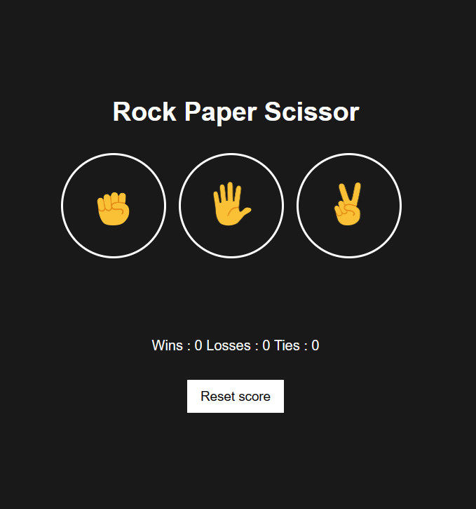

# js-projects

<h3>Technologies Used</h3>
<ul>
  <li>Html</li>
  <li>Css</li>
  <li>Java Script</li>
</ul>

<h3>Projects and Links</h3>
<ol>

  <li>Rock Paper Scissor</li>
  

    <code style="color: #c9d1d9;">https://rock-paper-scissor-js-project.netlify.app/</code>
    <a href="https://rock-paper-scissor-js-project.netlify.app/">
    <button style="float: right; color: #c9d1d9; background-color: #21262d; border: none; padding: 5px 10px; cursor: pointer; border-radius: 5px; margin-left: 10px">preview</button>
    </a>
  

  
</ol>
